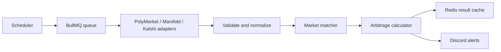

# Arbitrage Scanner

Prediction-market arbitrage scanner for comparing prices across PolyMarket, Manifold, and Kalshi.

The scanner fetches active binary markets, matches equivalent events across platforms, calculates fee-aware arbitrage opportunities, and can run continuously with Redis, BullMQ, and Discord alerts.

## Current capabilities

- PolyMarket, Manifold, and Kalshi market adapters
- Zod validation and normalized `StandardMarket` data
- Date, keyword, and Fuse.js fuzzy matching
- Decimal.js fee-aware profit and ROI calculations
- Redis caching and BullMQ background jobs
- Recurring scans across three platform pairs
- Optional Discord webhook alerts with thresholds and cooldowns
- Retry handling and per-platform API rate limiting

This repository scans and reports opportunities. It does not place trades.

## Architecture



The basic smoke test runs the PolyMarket adapter directly. The real-time path starts a BullMQ worker, schedules recurring scans, caches market data and results in Redis, and sends qualifying opportunities to Discord.

## Prerequisites

- Node.js 18+
- npm
- Redis for the real-time scanner, queue tests, and alert cooldowns
- Optional Discord webhook for alerts

## Installation

```bash
git clone https://github.com/starsnipe407/arb-scanner.git
cd arb-scanner
npm install
Copy-Item .env.example .env # PowerShell
```

For bash, use `cp .env.example .env` instead.

## Configuration

The runtime reads these variables from `.env`:

| Variable | Default | Purpose |
| --- | --- | --- |
| `REDIS_HOST` | `localhost` | Redis hostname |
| `REDIS_PORT` | `6379` | Redis port |
| `REDIS_PASSWORD` | empty | Optional Redis password |
| `ALERTS_ENABLED` | `true` | Enable or disable alert delivery |
| `DISCORD_WEBHOOK_URL` | empty | Discord webhook URL |
| `ALERT_MIN_PROFIT_PERCENT` | `5` | Minimum ROI percentage for alerts |
| `ALERT_MIN_PROFIT_AMOUNT` | `10` | Minimum dollar profit for alerts |
| `ALERT_COOLDOWN_MINUTES` | `10` | Duplicate-alert cooldown |

API endpoints, matching thresholds, fees, and scan defaults are currently defined in [`src/config.ts`](src/config.ts).

## Run it

### Basic PolyMarket smoke test

```bash
npm run dev
```

This fetches five PolyMarket markets and prints their normalized data and outcome-price sums.

### Real-time scanner

Start Redis first, then run:

```bash
npm run scan:realtime
```

The scheduler scans every 60 seconds:

- PolyMarket vs Manifold, up to 200 markets per side
- Kalshi vs PolyMarket, up to 100 markets per side
- Kalshi vs Manifold, up to 100 markets per side

Press `Ctrl+C` to stop. See [`REALTIME_SETUP.md`](REALTIME_SETUP.md) for Redis setup and operations.

### Discord alerts

Set `DISCORD_WEBHOOK_URL` in `.env`, then run:

```bash
npm run test:alerts
npm run scan:realtime
```

See [`ALERT_SETUP.md`](ALERT_SETUP.md) for webhook setup, thresholds, cooldowns, and troubleshooting.

## Testing and checks

The current checks are executable TypeScript scripts rather than a conventional discovered unit-test suite:

```bash
npm run test:calculator
npm run test:matcher
npm run test:errors
npm run test:queue       # Requires Redis
npm run test:alerts      # Requires Redis and a Discord webhook
npm run demo
```

`npm run build` runs the TypeScript compiler. Automated CI and standard Vitest test discovery are follow-up work.

## Repository structure

```text
arb-scanner/
├── src/
│   ├── adapters/       # PolyMarket, Manifold, and Kalshi API clients
│   ├── calculator/     # Fee-aware arbitrage calculations
│   ├── matcher/        # Cross-platform market matching
│   ├── services/       # Redis cache, BullMQ queue, and Discord alerts
│   ├── tests/           # Manual integration and demonstration scripts
│   ├── config.ts       # Matching, fee, API, and alert configuration
│   ├── scheduler.ts    # Continuous real-time scanner entry point
│   ├── types.ts        # Shared domain types
│   └── utils/          # Logging, retries, errors, and rate limiting
├── .env.example
├── package.json
├── REALTIME_SETUP.md
└── ALERT_SETUP.md
```

## Limitations and next improvements

- No trade execution; results require manual verification.
- Matching is heuristic and can produce false positives or miss equivalent markets.
- The scanner depends on upstream APIs and Redis availability.
- Tests are mostly manual scripts and are not yet organized as standard unit tests.
- API endpoints and market fees should be made consistently configurable.
- CI, health checks, and reproducible performance benchmarks are not yet included.

## License

MIT
