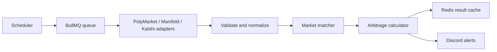

# Arbitrage Scanner 🚀

[](https://github.com/starsnipe407/arb-scanner/actions/workflows/ci.yml)
[](https://github.com/starsnipe407/arb-scanner)
[](https://nodejs.org/)
[](https://www.typescriptlang.org/)
[](https://redis.io/)
[](https://bullmq.io/)
[](LICENSE)

🔗 **Repository**: [github.com/starsnipe407/arb-scanner](https://github.com/starsnipe407/arb-scanner)

**Arbitrage Scanner** compares prediction-market prices across PolyMarket, Manifold, and Kalshi. It validates and normalizes active binary markets, matches equivalent events, calculates fee-aware opportunities, and can run continuously with Redis, BullMQ, and Discord alerts.

## ⚡ Current Capabilities

- 🎯 PolyMarket, Manifold, and Kalshi market adapters
- 🧩 Zod validation and normalized `StandardMarket` data
- 🔍 Date, keyword, and Fuse.js fuzzy matching
- 💰 Decimal.js fee-aware profit and ROI calculations
- 🔄 Redis caching and BullMQ background jobs
- ⏱️ Recurring scans across three platform pairs
- 🔔 Optional Discord webhook alerts with thresholds and cooldowns
- 🛡️ Retry handling and per-platform API rate limiting

⚠️ This repository scans and reports opportunities. It does not place trades.

## 🏗️ System Architecture



The basic smoke test runs the PolyMarket adapter directly. The real-time path starts a BullMQ worker, schedules recurring scans, caches market data and results in Redis, and sends qualifying opportunities to Discord.

## 📋 Prerequisites

- **Node.js**: 20 or newer
- **npm**
- **Redis**: required for the real-time scanner, queue checks, and alert cooldowns
- **Discord webhook**: optional, for alerts

## ⚡ Quickstart & Installation

### 1. Clone and install

```bash
git clone https://github.com/starsnipe407/arb-scanner.git
cd arb-scanner
npm install
```

### 2. Configure the environment

```bash
cp .env.example .env
```

On PowerShell, use `Copy-Item .env.example .env` instead.

The available variables are documented in [`.env.example`](.env.example).

### 3. Run a basic smoke test

```bash
npm run dev
```

This fetches five PolyMarket markets and prints normalized market data and outcome-price sums.

## 🚀 Running the Project

### Real-time scanner

Start Redis, then run:

```bash
npm run scan:realtime
```

The scheduler scans every 60 seconds:

| Pair | Markets per side |
| --- | ---: |
| PolyMarket vs Manifold | 200 |
| Kalshi vs PolyMarket | 100 |
| Kalshi vs Manifold | 100 |

Press `Ctrl+C` to stop. See [`REALTIME_SETUP.md`](REALTIME_SETUP.md) for Redis setup and operations.

### Discord alerts

Set `DISCORD_WEBHOOK_URL` and `ALERTS_ENABLED=true` in `.env`, then run:

```bash
npm run test:manual:alerts
npm run scan:realtime
```

See [`ALERT_SETUP.md`](ALERT_SETUP.md) for webhook setup, thresholds, cooldowns, and troubleshooting.

## 🧪 Verified Checks

The current checks are executable TypeScript scripts rather than a conventional discovered unit-test suite:

```bash
npm run test:config
npm run test:manual:calculator
npm run test:manual:matcher
npm run test:manual:errors
npm run test:manual:queue     # Requires Redis
npm run test:manual:alerts    # Requires Redis and a Discord webhook
npm run demo
npm run build
```

The GitHub Actions workflow runs both npm audits, the TypeScript build, the config check, and the calculator check on pushes and pull requests. Standard Vitest discovery and benchmark reporting remain follow-up work.

## ⚙️ Configuration

| Variable | Default | Purpose |
| --- | --- | --- |
| `REDIS_HOST` | `localhost` | Redis hostname |
| `REDIS_PORT` | `6379` | Redis port |
| `REDIS_PASSWORD` | empty | Optional Redis password |
| `POLYMARKET_API_URL` | public API URL | PolyMarket endpoint override |
| `MANIFOLD_API_URL` | public API URL | Manifold endpoint override |
| `KALSHI_API_URL` | public API URL | Kalshi endpoint override |
| `ALERTS_ENABLED` | `false` without webhook | Enable alert delivery |
| `DISCORD_WEBHOOK_URL` | empty | Discord webhook URL |
| `ALERT_MIN_PROFIT_PERCENT` | `5` | Minimum ROI percentage for alerts |
| `ALERT_MIN_PROFIT_AMOUNT` | `10` | Minimum dollar profit for alerts |
| `ALERT_COOLDOWN_MINUTES` | `10` | Duplicate-alert cooldown |

Matching thresholds, fees, logging, and scan defaults are defined in [`src/config.ts`](src/config.ts).

## 📁 Repository Structure

```text
arb-scanner/
├── src/
│   ├── adapters/       # PolyMarket, Manifold, and Kalshi API clients
│   ├── calculator/     # Fee-aware arbitrage calculations
│   ├── matcher/        # Cross-platform market matching
│   ├── services/       # Redis cache, BullMQ queue, and Discord alerts
│   ├── tests/          # Manual integration and demonstration scripts
│   ├── config.ts       # Matching, fee, API, and alert configuration
│   ├── scheduler.ts    # Continuous real-time scanner entry point
│   ├── types.ts        # Shared domain types
│   └── utils/          # Logging, retries, errors, and rate limiting
├── .env.example
├── ALERT_SETUP.md
├── LICENSE
├── package.json
└── REALTIME_SETUP.md
```

## 🛡️ Limitations & Next Improvements

- No trade execution; results require manual verification.
- Matching is heuristic and can produce false positives or miss equivalent markets.
- The scanner depends on upstream APIs and Redis availability.
- Tests are mostly manual scripts and are not yet organized as standard unit tests.
- CI, health checks, and reproducible performance benchmarks are not yet included.

## 📄 License

This project is licensed under the terms of the [MIT License](LICENSE).
